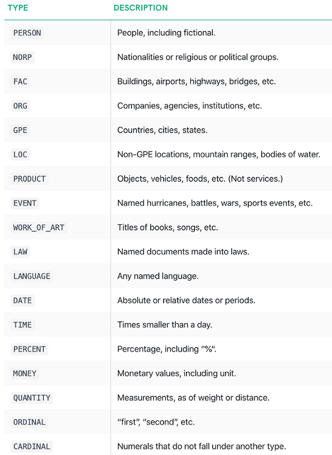

# named_entity_recognition

### Introduction
This project aims to create an API that will allow users to post news articles and extract the named entities that are identified from within each of the news articles.

The pretrained NLP core model from [spaCy](https://spacy.io/models/en#en_core_web_sm) will be used to recognise entities.

### Usage

### About the model
Spacy supports the following entity types:

  

    Entity recognised by spaCy core model <a href="https://spacy.io/api/data-formats#named-entities">(source)</a>

