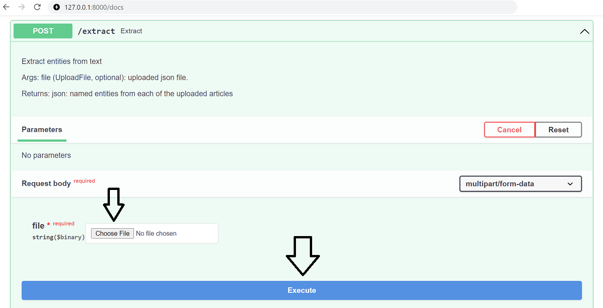
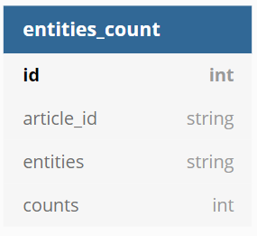
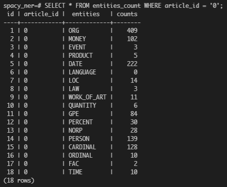

# Named Entity Recognition

## Introduction
This project aims to create a REST API that will allow users to post news articles and extract the named entities that are identified from within each of the news articles.

The pretrained NLP core model from [spaCy](https://spacy.io/models/en#en_core_web_sm) is used to recognise the entities.

## About the App
The REST API serves 4 endpoints:
1. `/info` [GET] - 
Retrieve information about the pretrained NER extractor.
2. `/extract` [POST] - 
Upload `.json` file to extract text and corresponding entities, returns results in json format.
3. `/count` [POST] - 
Uploads `.json` file to count the number of unique entities of each article, add results to database, returns job status.
4. `/docs` - 
Interactive Swagger UI


## Basic Usage
#### Step 1:
Clone this repository
```
git clone https://github.com/sngjoy/named_entity_recognition.git
cd named_entity_recognition
```

#### Step 2:
Create environment with the required packages.

```
conda env create -f conda.yml
```

#### Step 3:
Run the app and navigate to the URL!
```
uvicorn src.app_ner:app
```

#### Step 4:
Spin up PostgreSQL database and run Alembic to initialise the `count_entities` table. (More information about Alembic [here](https://github.com/sngjoy/named_entity_recognition/tree/main/alembic))
```
make run-db
alembic upgrade head
```
#### Step 5:
To POST file (.json):

**Option 1.** Use cURL
```
curl -X 'POST' \
  'http://127.0.0.1:8000/extract' \
  -H 'accept: application/json' \
  -H 'Content-Type: multipart/form-data' \
  -F 'file=@<FILENAME>.json; type=application/json'

curl -X 'POST' \
  'http://127.0.0.1:8000/count' \
  -H 'accept: application/json' \
  -H 'Content-Type: multipart/form-data' \
  -F 'file=@<FILENAME>.json; type=application/json'
```
**Option 2.** Use the Swagger UI directly from browser

Navigate to endpoint `/docs`
```
http://127.0.0.1:8000/docs
```
Upload file and click execute.
<p align="center">
  
</p>

## PostgreSQL Database
As stated earlier, the endpoint `/count` will store the results of each unique entities count into the PostgreSQL database table (`count_entities`).

For a better visualisation of the table, the following are the table schema and an example of a table.
<p align="center">
  
</p>

<p align="center">
    Table schema
</p>
<br>
<p align="center">
  
</p>

<p align="center">
    Table showing the entities and counts of a particular article.
</p>


## Dockerised app
To containerised the FastAPI app using Docker, run `docker-compose up --build`

## About the model
Spacy supports the following entity types:
<p align="center">
  
</p>

<p align="center">
    Entity recognised by spaCy core model <a href="https://spacy.io/api/data-formats#named-entities">(source)</a>
</p>

## Author
Joy Sng
